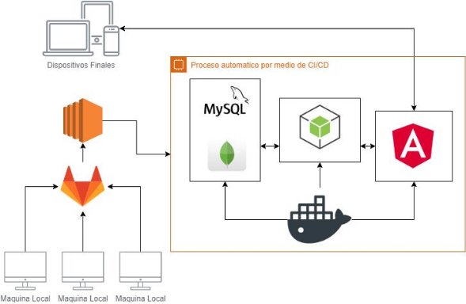

# Practica3_4_Grupo5

Repositorio dedicado para la práctica 3 y 4 del curso Análisis y Diseño 1 de la Universida de San Carlos de Guatemala.

201801370 Javier Antonio Chin Flores

201801364 Juan Daniel Enrique Roman Barrientos

201800464 Pablo Andres Argueta Hernandez

## INTEGRANTES
|   201801370                    |   201800464                        |    201801364                      |   
|:------------------------------:|:----------------------------------:|:----------------------------:     |
|   Javier Antonio Chin Flores   |   Pablo Andres Argueta Hernandez   |    Juan Daniel  Roman Barrientos  |   
|              |       |              |   
|   <a href="https://github.com/ChinJavier" target="_blank">`github.com/ChinJavier`</a>        |  <a href="https://github.com/PabloAndresArg" target="_blank">`github.com/PabloAndresArg`</a>|    <a href="https://github.com/dani3l8200" target="_blank">`github.com/dani3l8200`</a>        |   

# USANDO GITFLOW

Se utilizó gitflow para el desarrollo del proyecto, se tomaron los siguientes valores para la creación de cada una de las ramas correspondientes:

| Branch                              | Name     |
| ----------------------------------- | -------- |
| :beginner: production releases      | main     |
| :computer: next release development | develop  |
| :white_check_mark: Feature          | feature/ |
| :bug: Bugfix                        | bugfix/  |
| :rocket: Release                    | release/ |
| :fire: Hotfix                       | hotfix/  |
| :hammer: Support                    | support/ |
| :round_pushpin: Version tag prefix  | v        |

**Universidad de San Carlos de Guatemala  Facultad de Ingeniería   
**

**Escuela de Ciencias y Sistemas   Análisis y Diseño de Sistemas 1  Ing. Allan Morataya**   

**Aux. Brandon Pedroza** 

**Sección: “N”**

**Práctica No. 3 y 4 Integración Continua** 

Contenido  

Objetivos..............................................................................................................2  

Generales..............................................................................................................2  

Específicos............................................................................................................2 

Descripción............................................................................................................2  

Login………...............................................................................................................3  

Registro...............................................................................................................4  

Consultar Saldo........................................................................................................4  

Transferencia Monetaria................................................................................................4  

Reporte................................................................................................................4  

Pruebas Unitarias......................................................................................................5  

Pruebas Funcionales....................................................................................................5  

Sonar Qube.............................................................................................................5  

Manual Tecnico.........................................................................................................6  

Manual de Usuario......................................................................................................6  

Arquitectura...........................................................................................................7 

Consideraciones........................................................................................................8  

Fecha de Entrega.......................................................................................................9

Objetivos Generales 

- Conocer y entender los concepto de prueba funcionales 
- Comprender la importancia del trabajo en equipo 
- Conocer y entender los conceptos de integración continua. 

Específicos

- El estudiante podrá listar las diferentes pruebas que se pueden realizarse en un proyecto de software. 
- Aplicar al menos 2 tipos de pruebas a su proyecto de software. 
- Utilizar una herramienta para realizar integración continua a su proyecto. 

Descripción

Un banco muy conocido los ha contratado a usted y su equipo de trabajo del Curso de Análisis y Diseño de Sistemas 1 de la Escuela de Sistemas, para realizar un sistema de banca en línea, para que los clientes del banco puedan realizar sus gestiones sin salir de casa. 

Además, se debe contar con un proceso automatizado que, después de que cada desarrollador suba código al repositorio, se obtenga la última versión, se compile, se ejecuten el conjunto de pruebas unitarias y funcionales seleccionado, y se dejen los binarios/resultados en una ubicación conocida. 

El sistema bancario será una aplicación en línea, que necesita una herramienta de integración continua, para el conjunto de funcionalidades del banco (descritas en la sección funcionalidades del sistema bancario). La herramienta a utilizar queda a discreción del equipo de trabajo. Dicha herramienta nos ayudará a compilar el código  fuente  para  así  obtener  un  ejecutable  (build).  Además  se  pasarán  las pruebas para detectar los errores tan pronto como sea posible. 

Se usará un sistema de control de versiones, que lo elegirá el equipo de trabajo, acá se almacenará el código, scripts de test, librerías de terceros, etc. El sistema debe estar integrado (control de versiones y servidor de integración continua), se notificará vía correo electrónico los cambios hechos en el sistema de control de versiones, esta funcionalidad la incluye la herramienta. 

Se debe subir el código de las funcionalidades del banco al sistema de control de versiones, este debe compilar y ejecutar las pruebas de cada funcionalidad. Si el resultado  no  es  el  esperado  o  hay  algún  error,  la  herramienta  de  integración notificará a los desarrolladores vía correo electrónico. Si el build es correcto, debe integrar el código y subirlo al repositorio de control de versiones. Todo esto debe ser automatizado por la herramienta. Además se debe tener un proceso de build automático. 

Funcionalidades

El banco requiere un sistema en línea, para que cualquier usuario pueda entrar desde cualquier dispositivo, dicho sistema se le agregan funcionalidades en el transcurso  de  los  meses,  se  empezarán  con  las  funcionalidades  descritas  a continuación: 

- Login 

El login debe ser la primera página que el usuario deberá ver, si el usuario aún no está registrado, deberá registrarse primero. La página de login le pedirá al usuario: 

1. No. de cuenta 
2. Contraseña 
- Registro 

El usuario deberá registrarse si desea acceder a los servicios que le ofrece el banco. Esta página le retornara al usuario un código que se convierte en el número de cuenta de ese usuario. La página de registro le pedirá al usuario: 

1. Nombres 
1. Apellidos 
1. DPI 
2. No. de cuenta(No se puede repetir) 
2. Saldo inicial de la cuenta 
3. Correo electrónico 
3. Contraseña 
- Perfil de usuario 

Al ingresar se debe de mostrar una página principal con los datos del usuario con el que se ingresó y deberá contener un menú para las demás transacciones permitidas. 

- Consultar saldo

Se podrá consultar el saldo actual de la cuenta. 

- Transferencia monetaria

Se podrá transferir un monto ingresado a otra cuenta. 

- Reportes 

Se tendrá un módulo donde se podrá descargar las transferencias bancarias del usuario que realiza la consulta dependiendo del perfil, el reporte será descargado en pdf. 

Pruebas unitarias 

Cada función que se hace en el sistema debe pasar por al menos una prueba unitaria,  para  verificar  el  correcto  funcionamiento  de  la  unidad  de  código.  Las herramientas a utilizar dependen del lenguaje de programación. 

**Adicional a esto debe documentar los casos de prueba respectivos.** 

Pruebas funcionales 

Cada funcionalidad que se realice en el sistema debe pasar por sus respectivas pruebas funcionales, se plantearan casos de pruebas funcionales. Las herramientas a utilizar quedan a discreción del grupo de trabajo. 

Sonar Qube 

Se implementará esta herramienta para la evaluación de métricas del software, en esta categoría están las siguientes métricas: 

- **Complejidad ciclomática.** 
- **Código duplicado.** 
- **Comentarios.** 
- **Test.** 
- **Violaciones.** 

Para fines de esta práctica, solo se deberán escoger 3 y estas serán las evaluadas. Queda  a  discreción  de  cada  grupo,  se  deberá   enviar  un  correo  al  auxiliar confirmando que métricas serán las evaluadas por grupo. 

Manual Técnico 

El manual técnico deberá contener una descripción de la arquitectura empleada en el proyecto, incluyendo diagramas de cada uno de los componentes utilizados y los módulos realizados. Casos de Prueba documentados. 

Manual usuario 

El manual de usuario deberá ser una guía de la aplicación creada, para el usuario. 

Arquitectura a Implementar  

Actualmente se conocen diversas opciones para desarrollar una aplicación web, el equipo de desarrollo tiene la libertad de escoger las tecnologías que mejor se acoplen a sus necesidades, con la única condición que estas puedan ser sometidas a un proceso de Integración Continua.  

La integración continua es una práctica de desarrollo de software mediante la cual los desarrolladores combinan los cambios en el código en un repositorio central de forma periódica, tras lo cual se ejecutan versiones y pruebas automáticas.  

La aplicación debería de cubrir como mínimo las siguientes herramientas:  

- Un gestor de Bases de datos.  
- Un framework para el desarrollo del Frontend.  
- Un servidor para el desarrollo del Backend.  
- Un servidor de nube, para alojar la aplicación.  
- Un repositorio, para guardar los avances del proyecto.  

Ejemplo de Arquitectura 

Explicación de la Arquitectura 

- Las maquinas locales representan a los desarrolladores mandando sus cambios a un repositorio en GitLab.  
- GitLab se comunica con una instancia EC2 de AWS por medio de un Runner.  
- El Runner se encarga de crear imágenes de Docker y subirlas a algún repositorio de imágenes Docker (Por ejemplo, DockerHub).  
- En la instancia EC2 se encuentra instalado Docker y el Runner le indica a Docker que descargue las imágenes que se crearon y se subieron en DockerHub.  
- Una vez descargadas las imágenes, el Runner se encarga de indicarle a Docker todo lo necesario para que las aplicaciones se corran de manera automática.  
- Una vez este todo bien configurado, Docker será capaz de levantar las imágenes de las herramientas que conforman nuestra aplicación en la instancia EC2.  
- El resultado final es que nuestras aplicaciones estarán corriendo cierto tiempo después de hacer un commit con nuestros cambios implementados. 
- El hecho de usar una instancia EC2 es para que un usuario con los medios disponibles pueda consultar nuestra aplicación.  

Consideraciones 

- Se deberá trabajar con los grupos trabajados hasta el momento. 
- Hacer uso de gitflow para el repositorio. 
- **Se debe utilizar la metodología SCRUM para el desarrollo de la aplicación.** 
- Agregar al usuario @BrandonPedroza como **colaborador** al repositorio de trabajo para revisión de los commits 
- Dudas serán resueltas en los diferentes canales disponibles: Foros de UEDi, correo, slack, etc. 
- **Todo debe estar corriendo en la Nube.** 
- Cada commit debe tener un mensaje descriptivo. 
- La herramienta para integración continua y control de versiones queda a discreción de los estudiantes. 
- Copias totales y parciales tendrá una nota de 0 y será reportada a la escuela de sistemas. 
- Entregables: 
- Se debe enviar el manual de usuario y técnico y se revisara el código del último commit de la fecha de entrega. 
- Nombres de Archivo: [AyD1]Manual Tecnico\_G#grupo.pdf                                                  [AyD1]Manual Usuario\_G#grupo.pdf 
- Entregar vía UEDI (una persona por grupo). 

Fecha De Entrega Fase 1 – 11/10/2021 (Practica 3) 

1. Arquitectura empleada. 
1. Repositorio con Workflow. 
1. Pruebas Unitarias. 
1. Manual Técnico. 
1. Diagrama de Arquitectura 
1. Casos de Prueba. 

Fecha De Entrega Fase 2 – 25/10/2020 (Practica 4) 

1. Pruebas funcionales. 
1. Sonar Qube. 
1. App. 
1. Pruebas Completa de Integración Continua. 
1. Documentación completa con agregados de fase 2. 
PAGE9 
